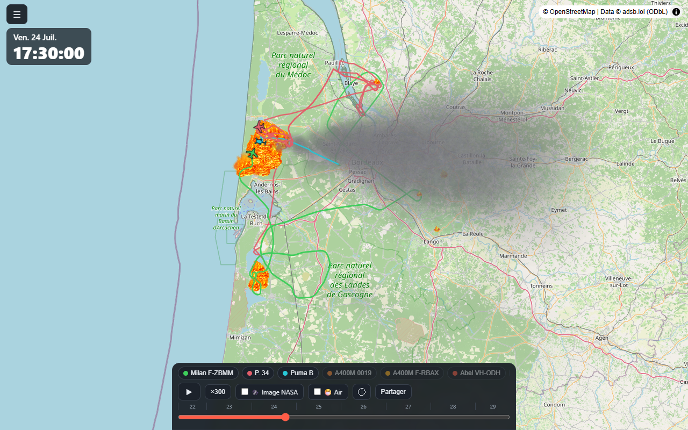
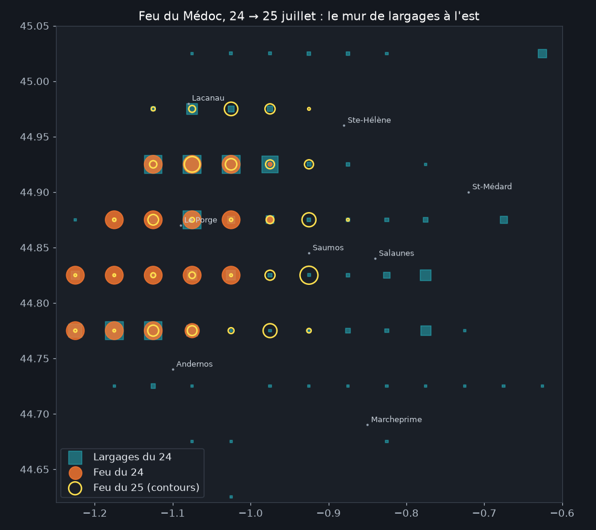
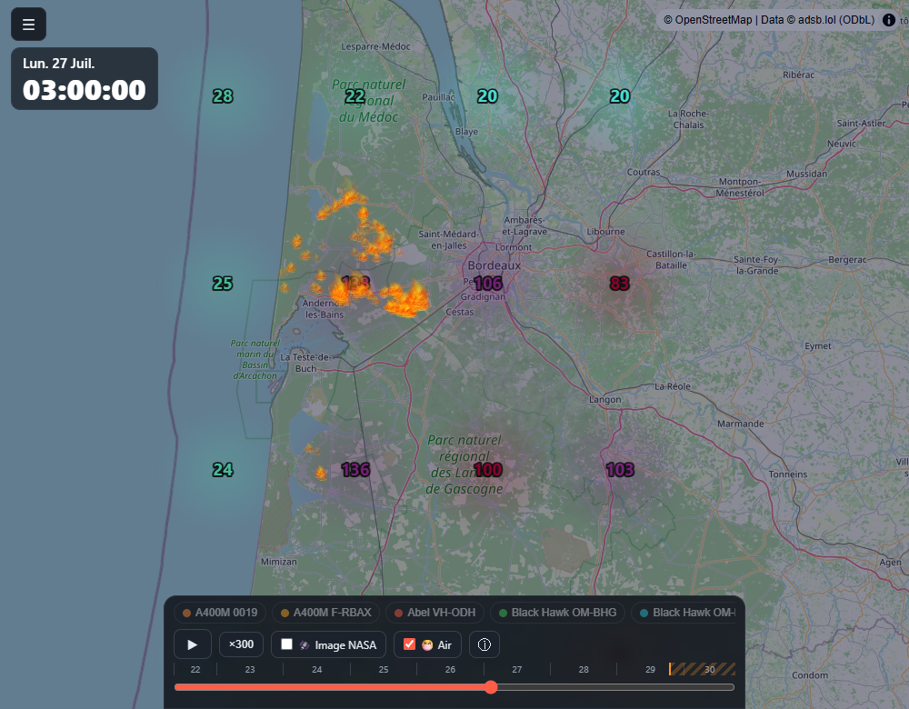

# Fire Tracker

**https://firetrack.harari.ovh** : carte interactive qui rejoue, heure par heure, les moyens
aériens engagés contre les feux de Gironde et des Landes (juillet 2026) : Canadair, Dash 8,
Air Tractor, A400M, hélicoptères, renforts européens : avec les zones de feu détectées par
satellite, la fumée simulée par le vent réel et la qualité de l'air.



Étude des sources de données : [RECHERCHE_DONNEES.md](RECHERCHE_DONNEES.md) ·
Extraction CSV complète : [open-data/](open-data/) ·
**Les analyses : https://firetrack.harari.ovh/analyse/**

## Fonctionnalités

- **Timeline continue multi-jours** avec règle graduée, lecture ×30 à ×3600, double-clic
  gauche/droite sur la carte = ±10 minutes
- **Mode Prévision +24 h** : au-delà des dernières données, la fumée dérive selon le vent
  prévu et l'air passe sur la prévision CAMS ; badge de fiabilité, voile orangé, foyers figés
  à leur dernier état connu (on ne prétend pas prévoir le feu)
- **Fiche appareil** : photo (planespotters), altitude/vitesse, compteur de largages/écopages
  estimés du jour, bouton "Suivre cet avion" (ou "Aller à son prochain vol" s'il est absent)
- **Feux** : détections satellites VIIRS + MODIS (6-8 passages/jour), flammes animées (sprites),
  ⓘ avec l'heure de la dernière détection
- **Fumée** : panaches simulés à partir des foyers détectés et du vent horaire réel
- **Couches optionnelles** : 🛰️ image satellite NASA du jour affiché (désactivée tant qu'elle
  n'est pas publiée), 😷 indice européen de qualité de l'air (grille CAMS, valeurs affichées)
- **Nuit astronomique** (voile calé sur l'altitude réelle du soleil), hélicos à rotor animé,
  icônes orientées au cap, traces qui suivent les avions à la frame près
- **Partage d'un moment précis** : bouton Partager (site ou instant courant) et liens profonds
  `/?t=<epoch>` qui ouvrent la carte à la seconde voulue

## Les analyses de données

Sept analyses publiées sur [/analyse/](https://firetrack.harari.ovh/analyse/), construites
sur ~480 000 lignes de données : vulgarisées, sourcées, reproductibles (un script
`scripts/analyse_*.py` par sujet), datées avec historique de révisions, et honnêtes sur
leurs biais (chaque page a son encadré "Méthode et limites") :

1. **Des zones ont-elles été privilégiées par les largages ?** : pourquoi on borde les
   lisières au lieu de noyer le brasier
2. **Le rendement des norias** : hélicos toutes les 6 min, Dash toutes les 36 : trois
   familles, trois cadences
3. **A400M et Canadair : deux doctrines de largage** : le "1 A400M = 3 Canadair" passé
   au crible
4. **Les largages arrêtent-ils le front ?** : une leçon de biais de sélection, et la ligne
   qui a tenu face à Bordeaux
5. **Le feu et le vent** : trois régimes de vent, trois incendies successifs
6. **La montée en puissance des renforts** : 9 pavillons, et la relève européenne à 80 %
7. **La fumée et l'air qu'on a respiré** : le pic de pollution à 4 h du matin, expliqué

|  |  |
|---|---|
| *Le "mur de largages" du 24/07 face au front est* | *La nuit du 26-27 : l'air vire au rouge jusqu'à Bordeaux* |

## Architecture : 100 % statique à la publication

```
[CLI backend (cron)] --> SQLite (data/canadair.db) --> JSON statiques (frontend/public/data/)
                                                            |
[Navigateur visiteur] <-- HTML/JS/CSS statiques (dist/) <---+
```

- **Aucun backend ne tourne pour servir le site** : nginx sert un build Vite + des JSON.
- Appels réseau du pipeline (uniquement quand les commandes tournent) : GitHub/adsb.lol,
  NASA FIRMS, Open-Meteo, hexdb.io/adsbdb.com, planespotters.net, airplanes.live.
- Appels du navigateur visiteur : tuiles OpenStreetMap, tuiles NASA GIBS (si cochée),
  vignettes photos. Aucune clé côté client.

## Backend (pipeline CLI)

Python **sans aucune dépendance** (stdlib uniquement), base SQLite.

```
python backend/cli.py fleet              # synchronise la flotte de fleet.json (hex ICAO)
python backend/cli.py ingest             # archive complète de la veille (adsb.lol, ~4 Go streamés)
python backend/cli.py ingest 2026-07-25 --force   # re-traiter un jour (après ajout d'appareils)
python backend/cli.py today              # traces live des ~24 dernières heures (jour courant)
python backend/cli.py discover           # ajoute les moyens aériens détectés en vol autour du feu
python backend/cli.py fires              # points chauds NASA FIRMS, VIIRS + MODIS (bbox Gironde+Landes)
python backend/cli.py wind               # vent horaire Open-Meteo (+24 h de prévision)
python backend/cli.py air                # qualité de l'air CAMS, grille 20 points (+24 h de prévision)
python backend/cli.py photos             # photos des appareils (planespotters.net, en cache)
python backend/cli.py export 2026-07-25  # écrit frontend/public/data/<jour>.json + index.json
python backend/cli.py status             # résumé de la base
```

Toutes les commandes sont **idempotentes** : relançables sans risque, dédoublonnage automatique
(le live du jour et l'archive du lendemain fusionnent sans doublon).

### Cron (celui du VPS de prod)

```cron
# jour courant : traces live + feux + vent + air + export, toutes les 30 minutes
*/30 * * * * /var/www/firetrack/scripts/live.sh >> /var/log/firetrack.log 2>&1

# consolidation de la veille (fleet + archive complète) : la première tentative qui trouve
# la release adsb.lol fait le travail, les suivantes ne coûtent qu'une requête
0 6,9,12,18 * * * /var/www/firetrack/scripts/daily.sh >> /var/log/firetrack.log 2>&1

# détection automatique des moyens aériens engagés (pendant un épisode de feu)
*/10 * * * * cd /var/www/firetrack && python3 backend/cli.py discover >> /var/log/firetrack.log 2>&1
```

Ne jamais écrire `cmd1 && cmd2 >> log` directement en crontab (la redirection ne capturerait
que la dernière commande) : passer par les scripts. Optionnel : `GITHUB_TOKEN` en variable
d'environnement pour la limite anonyme de l'API GitHub.

## Flotte (69 appareils suivis)

Trois mécanismes complémentaires :

- **Statique** : [backend/fleet.json](backend/fleet.json) : Pélican (CL-415), Milan (Dash 8),
  Abel/Tract (Air Tractor 🇦🇺🇪🇸🇿🇦🇸🇪🇱🇺), toute la flotte A400M française, M18 Dromader 🇵🇱,
  Black Hawk 🇸🇰, CH-53 🇩🇪, Super Puma 🇨🇭 et hélicoptères. Champ `hex` optionnel pour les
  immatriculations absentes des bases publiques (militaires, loués). Ajouter une ligne suffit :
  `daily.sh` synchronise.
- **Dynamique** : `discover` scanne l'API live autour du feu toutes les 10 min et ajoute tout
  bombardier d'eau détecté (callsigns `PELICAN/MILAN/ABEL/TRACT/DRAGON/GAF/GRIFN/PUMA/MORA...`,
  types `CL2T/AT8T/DH8D/A400/EC45/H53/H60...` sous 15 000 ft).
- **Communautaire** : les signalements de spotters (hex, immat ou callsign) s'ajoutent en une
  ligne de `fleet.json` ; leur historique se récupère en re-traitant les archives
  (`ingest <jour> --force`). Merci NoX 🙏
- Limites connues : certains appareils n'émettent pas d'ADS-B (hélicos légers type Charlie 33,
  Dragons) ou seulement en Mode-S triangulé hors de portée des réseaux ouverts.
- L'export ne publie que les appareils passés par la zone Gironde/Landes le jour concerné
  (filtre géographique : les A400M en mission ailleurs n'apparaissent pas).

## Frontend

```
npm run dev --prefix frontend      # dev sur http://localhost:5173
npm run build --prefix frontend    # build de production dans frontend/dist/
node frontend/scripts/check.mjs    # diagnostic headless (console + état DOM + screenshot)
```

React + MapLibre GL (fond OSM sans clé). Rendu étagé : couches GeoJSON pour le stable
(historique persistant, tracé sélectionné), **canvas overlay** pour tout ce qui bouge à chaque
frame (traînées, flammes, fumée, air), **marqueurs DOM SVG** pour les appareils : le tout
synchrone à la frame près.

## Open data

`python scripts/export_csv.py` régénère [open-data/](open-data/) : l'intégralité des données
(trajectoires par jour, feux, vent, air, flotte) en CSV aux colonnes lisibles, avec licences
et attributions dans son README.

## Déploiement (VPS)

1. Cloner dans `/var/www/firetrack` (propriétaire `ubuntu`, **jamais sudo** pour git/npm/python).
2. Copier les données locales : `data/canadair.db`, `frontend/public/data/*.json`,
   `backend/firms_key.txt` (gitignoré). ⚠️ scp de la base : hors passage de cron.
3. `npm install --prefix frontend && npm run build --prefix frontend`
4. nginx : voir [nginx/firetrack.conf](nginx/firetrack.conf) : `root` sur `frontend/dist`,
   **alias `/data/`** vers `frontend/public/data/` (les exports du cron sont servis sans
   rebuild), `index.html` en no-cache, certbot pour le SSL.
5. Installer les crons ci-dessus (`/var/log/firetrack.log` appartenant à `ubuntu`).

Mise à jour courante : `git pull && npm run build --prefix frontend` (+ `python3 backend/cli.py
fleet && ./scripts/live.sh` pour voir un ajout de flotte sans attendre le cron).

## Sécurité et vie privée

- Seul secret : la clé NASA FIRMS (`backend/firms_key.txt`, gitignoré, ou env `FIRMS_MAP_KEY`).
- Site publié 100 % statique : pas de base exposée, pas d'API à protéger.
- **Aucune donnée personnelle collectée** : pas de compte, pas de formulaire, pas de cookies
  publicitaires. La seule mesure d'audience est un **Matomo auto-hébergé** (aucun tracker
  tiers type Google Analytics, rien ne quitte l'infrastructure du site). Les positions
  d'aéronefs affichées sont des données publiques diffusées par les appareils eux-mêmes.
- Les seules requêtes tierces du navigateur sont techniques : tuiles de carte (OSM, NASA GIBS)
  et vignettes photos (planespotters) : chargées sans identifiant de session.
- Ne jamais exposer `backend/` ni `data/` dans nginx.

## Attribution

Data © [adsb.lol](https://www.adsb.lol) contributors
([ODbL 1.0](https://opendatacommons.org/licenses/odbl/1-0/)) · Feux
[NASA FIRMS](https://firms.modaps.eosdis.nasa.gov) (VIIRS/MODIS) · Météo & air
[Open-Meteo](https://open-meteo.com) (CC BY 4.0) / [Copernicus CAMS](https://atmosphere.copernicus.eu/) ·
Fond [OpenStreetMap](https://www.openstreetmap.org) · Imagerie
[NASA GIBS](https://www.earthdata.nasa.gov) · Photos [planespotters.net](https://www.planespotters.net)

Vibe codé avec [Claude Code](https://claude.com/claude-code) · Crédits : Guillaume HARARI,
avec l'aide de [NoX](https://x.com/nox33) pour l'identification des appareils.
